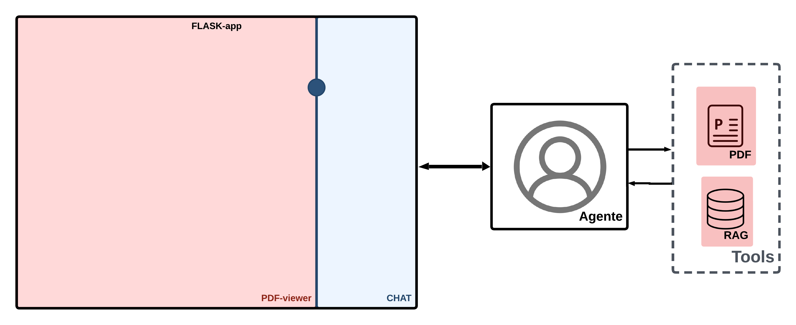
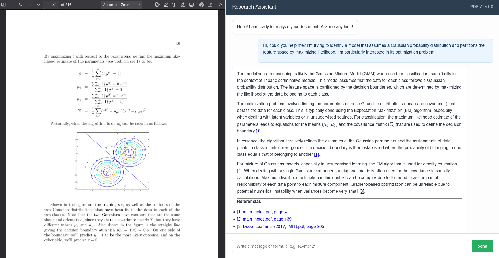

# AI PDF Research Assistant

## Welcome!
This "full-stack" web application revolutionizes how you interact with PDF documents. It provides an intuitive, **split-screen interface** where you can read your research papers, reports, or textbooks on one side, while simultaneously engaging in a real-time conversation with an intelligent **AI agent** on the other. 

Get instant summaries, ask targeted questions, or dive deep into specific sections of your document, all powered by LLMs.

---

## Architecture Overview
The project is engineered as a **microservices-based system**, leveraging the power of Docker to orchestrate two independent, yet interconnected, services:

* **Frontend Service (Flask):** The user-facing component that delivers the web interface and manages client-side interactions.
* **Agent Service (FastAPI):** The AI-powered backend responsible for document analysis, processing user queries, and generating intelligent responses.

### How the Services Interact:
1.  **User Request:** Your web browser communicates directly with the Flask Frontend.
2.  **AI Interaction:** When you send a message, Flask acts as a proxy, forwarding your query to the FastAPI Agent via an internal Docker network.
3.  **PDF Handling:** If the AI needs to reference or retrieve a PDF, Flask requests the file from FastAPI, saves it temporarily in its `static/` directory, and then displays it in the `<iframe>`.

---

## Key Features
* **Interactive Split-Screen UI:** View documents and chat with the AI side-by-side, with a draggable divider for a customizable layout.

* **Intelligent AI Agent:** Get summaries, explanations, and answers directly from your PDF content through a conversational interface.
* **Dynamic PDF Navigation:** The AI can generate direct links to specific pages within the PDF (e.g., `document.pdf#page=5`), allowing for quick jumps to relevant sections.
* **Content Formatting:** Full support for **Markdown** (bold, lists, code blocks) and advanced **LaTeX** mathematical equations (via KaTeX).
* **Chat History:** Your conversation with the AI is maintained, allowing you to pick up where you left off.

---

## Technology Stack
* **Frontend:** HTML5, CSS3 (Flexbox), JavaScript (Vanilla). 
    * *Libraries:* `Split.js`, `Marked.js`, `KaTeX`.
* **Backend Proxy:** Python / Flask.
* **AI Engine:** Python / FastAPI (Agent Service).
* **Deployment:** Docker & Docker Compose.

---

## Further Documentation
For more detailed information, please explore the following guides:

* [Flask Service](./docs/flask_service.md) - Flask service overview.
* [Agent Service](./docs/agent_service.md) - Agent service overview.
* [Docker Deployment](./docs/docker_setup.md) - How to run the containers.

---

## License
...